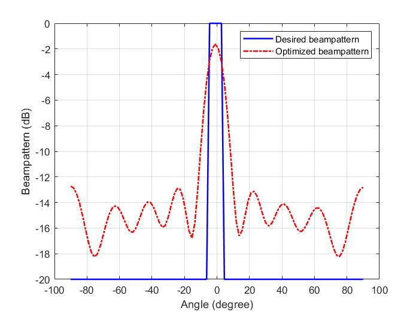

# CVX Beampattern Design for ISAC via CVX

This project contains MATLAB/CVX examples for transmit beampattern design with a 10-element uniform linear array (ULA).  The scripts formulate convex optimization problems that fit a desired angular power pattern, and include an iterative relaxation intended to recover a constant-modulus beamforming matrix.



## Requirements

- MATLAB (the scripts use the `db` plotting utility supplied by MATLAB toolboxes).
- [CVX](http://cvxr.com/cvx/) installed and initialized with `cvx_setup`.
- A CVX-compatible solver. The default solver selected by CVX is sufficient for these small examples.

## Files

| File | Purpose |
| --- | --- |
| `main.m` | Designs a positive-semidefinite transmit covariance matrix by least-squares fitting of a desired power beampattern. It also saves the resulting pattern as `beampattern.mat`. |
| `main_constant.m` | Reads `beampattern.mat` and performs iterative penalty-based optimization for a beamforming matrix with approximately unit-modulus entries. |
| `beampattern.m` | An independent ULA weight-vector design example. It fits a desired mainlobe and limits sidelobes; its communication-direction constraints are currently commented out. |
| `beampattern.mat` | Desired/optimized pattern data saved by `main.m` and used by `main_constant.m`. |
| `fig1.jpg`, `fig2.jpg`, `f1.jpg`, `f2.jpg`, `beampattern.fig` | Saved figures and MATLAB figure file from example runs. |

## Quick start

Open MATLAB, set this folder as the current folder, and run:

```matlab
main
```

`main.m` will:

1. Create 100 angle samples over \(-90^\circ\) to \(90^\circ\).
2. Define a narrow broadside target power pattern.
3. Optimize a Hermitian positive-semidefinite covariance matrix `C` and nonnegative scale factor `a`.
4. Enforce the total transmit-power constraint `trace(C) <= P`.
5. Plot and save the desired and optimized beampattern.

To run the approximate constant-modulus design afterwards:

```matlab
main_constant
```

Run `main.m` first, because `main_constant.m` loads `beampattern.mat`.

To run the separate weight-vector example:

```matlab
beampattern
```

## Optimization models

### Covariance-matrix beampattern fitting (`main.m`)

For steering vector \(\mathbf a(\theta)\), the beampattern is

\[
p(\theta)=\mathbf a^H(\theta)\mathbf C\mathbf a(\theta).
\]

The script minimizes the sampled squared fitting error

\[
\min_{\mathbf C\succeq0,\,a\ge0}
\frac{1}{N}\sum_i\left|a p_d(\theta_i)-
\mathbf a^H(\theta_i)\mathbf C\mathbf a(\theta_i)\right|^2,
\]

subject to `real(trace(C)) <= P`.

### Approximate constant-modulus design (`main_constant.m`)

This script uses slack matrices `E` and `F` plus a penalty weight `rho` to encourage each entry of `C` to have magnitude one. It alternates between solving a CVX subproblem and updating the previous iterate `C0`. The loop stops when the largest slack value is no greater than `delta`, the solver fails, or `iter_num` is reached.

### Weight-vector design (`beampattern.m`)

The third script optimizes a complex vector `u` to approximate a desired response in a mainlobe and restrict the maximum sidelobe magnitude:

```matlab
norm(u' * a_main - pattern_dir, 1) <= b
max(abs(u' * a_side)) <= 0.1
```

The variables `theta_com`, `a_com`, and `delta` are prepared for a communication-direction constraint, but the corresponding constraint is commented out in the current code.

## Key parameters

| Parameter | Default | Meaning |
| --- | ---: | --- |
| `N` | `10` | Number of ULA elements. |
| `P` | `1` | Total transmit-power upper bound in `main.m`. |
| `theta` | 100 samples in `[-pi/2, pi/2]` | Angular grid for covariance-pattern fitting. |
| `iter_num` | `10` | Maximum iterations in `main_constant.m`. |
| `rho` | `0.1` initially | Penalty coefficient for constant-modulus relaxation. |
| `delta` | `1e-2` | Stopping tolerance for the slack matrices. |

## Notes

- `main.m` saves a variable named `p` to `beampattern.mat`; rerunning it overwrites that file.
- The `save('beampattern', 'p')` calls use MATLAB's current working directory. Run the scripts from this project folder to keep generated files together.
- The examples are intended for educational experimentation. For reproducible research, record the CVX version, solver, solver tolerances, and random seed used by `main_constant.m`.

